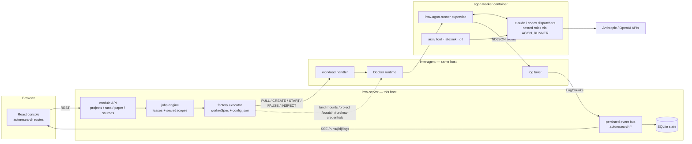
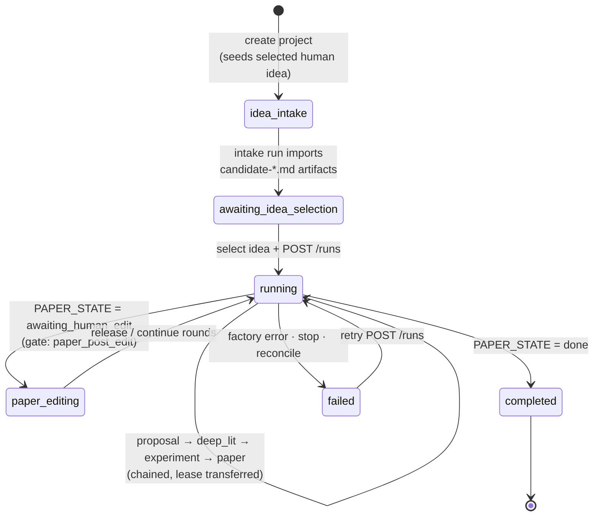

# AutoResearch Factory — Architecture & Run Book

> As of branch `feature/autoresearch-agon` @ `7d53ae2`. Generated from a four-part
> implementation audit (backend orchestration, worker/runner, server/jobs/DB, web UI).

AutoResearch runs a research pipeline (idea → proposal → deep lit → experiment → paper)
by dispatching each factory step as a **digest-pinned OCI worker container** through the
node agent's Docker runtime. The whole thing runs on a single machine: the server
auto-selects a co-located "local runner" node and proves colocation with a shared-root
sentinel container before every run. Remote GPU workers over SSH are strictly opt-in.

## 1. Dispatch and event flow

Highlights:

- **One job kind per concern.** `autoresearch-factory` (idea, proposal, deep_lit,
  experiment, paper), plus side jobs `autoresearch-paper-edit` (writer chat) and
  `autoresearch-paper-compile`. All executors registered; no orphan job types.
- **Colocation is enforced, not assumed.** The executor resolves the runner node by
  matching the server's hostname against approved+online nodes' inventory
  (`executor.go:45-85`), then proves shared-root colocation with a sentinel container
  (`executor.go:413-449`) before the real worker starts.
- **Credential flow is scrubbed both ways.** Secrets named by `secret_scope`s in the run
  input are decrypted by the jobs engine, written as `0600` files under
  `scratch/<run>/credentials`, read-only mounted at `/run/lmw-credentials`
  (`LMW_CREDENTIAL_DIR`), and scrubbed before and after each run. The runner's event
  obfuscator redacts mounted secret values from all public events.
- **Events ride stdout.** Nested role processes speak a framed protocol over
  `/scratch/agon-events.sock` (1-byte handshake, 4-byte BE length, JSON ≤ 1 MiB, 14
  whitelisted types); `supervise` multiplexes everything to NDJSON on container stdout;
  the agent tails it into `LogChunk`s; the server parses, persists invocation records
  (role / backend / model / tokens / parent-id), and republishes as `autoresearch.*` bus
  topics. The UI consumes the same stream via SSE with byte-cursor resume.

## 2. Project lifecycle

- Chaining is **automatic** once a run starts: each executor's `continueFactoryLifecycle`
  submits the next child run with the parent's lease atomically transferred
  (`jobs.go:310-338`). A human never chains factories by hand.
- The paper factory **loops on itself**, re-reading `PAPER_STATE.md`'s phase each round:
  `needs_experiment` hands back to experiment with `paper_request`, `done` completes the
  project.
- Configurable gates `claim_scope_change`, `citation_change`, `experiment_handback`
  (default **off**) pause the chain by publishing `decision.required` and ending the run;
  the operator resumes by POSTing `/runs` again. `idea_selection` and `paper_post_edit`
  are structural stops, not config.
- The project status machine is advisory: `SetAutoResearchProjectStatus` is an
  unconditional update; run-level state lives in the generic run ledger
  (`queued → running → terminal`) and one-shot runs are marked interrupted on controller
  restart.

## 3. Provider model

| Source | Backends | Requirements | Notes |
| --- | --- | --- | --- |
| `lmw` | `codex` (forced) | Healthy serving deployment with an OpenAI-Responses-compatible `/responses` endpoint; live tool-call probe at run submission | Keyless: worker sends `OPENAI_API_KEY=lmw-local` |
| `external` | `claude` | `ANTHROPIC_API_KEY` secret (`model_provider` purpose) | |
| `external` | `codex` | `OPENAI_API_KEY` secret, optional `base_url` | |
| `external` | `claude-ds` | `ANTHROPIC_AUTH_TOKEN` secret | **No binary in the image — unusable today** |

Role routing: project `roles[role]` → `roles.default` → module settings
`default_role_assignments`, plus per-role `fallbacks`. At least one `default` role
provider must resolve or every run dies with `autoresearch.provider_unavailable`.

### Running on local models (the `lmw` path)

`source: "lmw"` providers cannot point at an arbitrary URL — `resolveProviderMap`
(`modules/autoresearch/backend/providers.go:65-68`) fetches a **serving-module
deployment by ID** and requires `ObservedState == "healthy"` with an endpoint. A local
model becomes usable by the factory only as a **recipe → deployment** on an enrolled
node: author/import the recipe in the Library, deploy it via the Serving module, and
once it is healthy select it as the provider for factory roles. The in-container codex
CLI then drives the model keylessly over the deployment's OpenAI-Responses-compatible
endpoint.

Probe contract (verified against ollama 0.17.1): the executor POSTs
`{endpoint}/responses` with `stream: true`, a disposable `lmw_probe` function tool, and
`tool_choice: "required"`, and accepts the response only if it streams SSE containing a
`function_call`/`tool_call` named `lmw_probe` (`providers.go:15-51`). Ollama 0.17.1
implements `/v1/responses` with streaming tool calls and passes this probe verbatim —
relevant if packaging ollama (or llama.cpp's server) as an LMW recipe for CPU/Vulkan
nodes. Note the shipped recipes target SGLang + CUDA hardware (RTX 6000 Pro, DGX
Spark) and will not run on such nodes.

## 4. Worker image contract

`workers/agon/Dockerfile` → ubuntu 24.04 + node 22, `@openai/codex@0.149.1`,
`@anthropic-ai/claude-code@2.1.241`, git, uv, python3, latexmk + texlive + biber +
poppler-utils. Copies `third_party/agon/` (a Claude Code prompt/skill plugin — data, not
compiled code) to read-only `/opt/agon` and the `lmw-agon-runner` binary in. Container:
read-only rootfs, caps dropped, user = project dir uid:gid, bridge network, mounts
`/project` (artifacts git repo), `/scratch` (per-run HOME + TMPDIR + events socket),
`/run/lmw-credentials`. Resource caps: 16 GiB / 8 CPU / 512 pids, **no GPUs**.

The Agon plugin hard-gates the idea/proposal/deep-lit/experiment ticks on a readable
`${CLAUDE_PLUGIN_ROOT}/.settings.toml` (env-validator agent) — see gap G1.

## 5. Single-machine run checklist (ordered)

1. `lmw-server` running with required HTTPS env (`LMW_PUBLIC_ORIGIN`,
   `LMW_PUBLIC_AGENT_URL`, `LMW_SERVER_NAME` — e.g. Tailscale + `tailscale serve`).
2. Enroll `lmw-agent` on the same host (token + CA fingerprint, then **approve** the
   pending node in the console).
3. Build the worker image with the submodule checked out **and** `.settings.toml`
   placed at `third_party/agon/.settings.toml` (baked in via `.dockerignore`
   whitelist), then record its `@sha256:` digest.
4. Module settings (API only — no UI): `worker_image` = digest-pinned ref,
   `default_role_assignments` with a `default` provider, optional `ssh_hosts`.
5. Providers, one of:
   - **Local models (`lmw`)**: import a serving recipe (e.g. an ollama or llama.cpp
     container recipe for CPU/Vulkan nodes), deploy it on the local agent, wait for
     `healthy`, and select it via `deployment_id` in role assignments.
   - **External APIs**: store provider credential(s) as `model_provider` secrets and
     reference them by `secret_name` in role assignments.
6. Create project → attach sources (all must resolve `ready`) → generate ideas →
   select → `POST /runs` → human gates at idea selection and paper release.

## 6. Gap register

### B1 — Code bug (blocks browser-driven runs)
- **Project config saves 405.** UI calls `http.put` (`web/app/lib/api/index.ts:330`);
  the server registers PATCH only (`api_gen.go:1747`, per `api.yaml`). Every
  role-routing/advisor/topic save fails. MSW tests mock PUT, masking the mismatch
  (`web/test/autoresearch-route.test.tsx:233,271`). Fix: add a `patch` helper and use
  it.

### G — Setup gaps (no code path; operator closes them)
- **G1 `.settings.toml` absent from the image.** Only the example ships; `/opt/agon` is
  root-owned read-only on a read-only rootfs, so the env-validator gate always fails
  (`third_party/agon/agents/env-validator.md:17`). Bake one in before
  `make worker-image`.
- **G2 Digest pinning is manual.** `make worker-image` produces a tag; settings require
  `^.+@sha256:[0-9a-f]{64}$` (`executor.go:122-127`) and nothing extracts/sets the
  digest. Also verify the pre-create `PULL` op against a purely local image — may
  require a registry push or the Library OCI-import path.
- **G3 `ARXIV_CACHE_DIR` / `ARXIV_WIKI_DIR` unset anywhere** while deep_lit requires
  them; `arxiv_tool.py`'s default cache lives under read-only `/opt/agon` and would
  fail on mkdir. Fix: set both ENVs to writable `/scratch` paths in the Dockerfile or
  `workerSpec`.
- **G4 No module-settings or secrets UI.** `usePutModuleSettings` /
  `usePutSecret` defined but mounted nowhere; settings + secrets are CLI/curl only.

### M — Mid-run limitations (survivable, know them)
- `claude-ds` backend accepted by schema/runner but the binary does not exist in the
  image → any claude-ds candidate fails at exec and falls through the fallback chain.
- Advisors with `source:lmw` are never resolved server-side (`providers.go:78-97`
  handles roles/fallbacks only) → advisor spawn fails mid-run. Advisors must be
  external or disabled (the default).
- A `blocked`/`failed` source is unrecoverable: no PATCH/DELETE source endpoint, and
  all sources must be `ready` before idea generation (`api_runs.go:127-132`). Only
  escape: topic-only intake or project recreation.
- Gate resume has no approve API; resuming means re-POSTing `/runs` (server re-derives
  the same factory). No restart-from-earlier-factory control after `failed`.
- `cost_usd` is effectively always 0: the normalizer reads `cost_usd`
  (`normalize.go:43-47`) but Claude emits `total_cost_usd` and codex emits token counts
  only; no pricing table exists. UI fixture fields `output_rate`/`context_percent` are
  never produced server-side.

### D — Dead surface (write-only / unread)
- `ListAutoResearchInvocations`, `ListAutoResearchMessages`,
  `StartAutoResearchInvocation`, `UpdateAutoResearchRunSession` queries: no callers —
  no read API for invocation or chat-message ledgers.
- Project config keys `paper_max_rounds` (shadowed by plugin `.settings.toml`),
  `auditor_prompts` (never read), `candidate_count` (generate endpoint uses the query
  param, defaults 1), and `human_gates.idea_selection` / `.paper_post_edit` (inert —
  enforced structurally).
